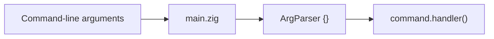

# Building a version manager for Zig (Part 1)

Welcome to the first part of a series of posts where you will accompany me in the development of a version manager for Zig. The tool will be an open-source command-line tool written in Zig.The goal of this serie is not a tutorial but rather an aggregation of facts worthy of being mentionned in this project. I will try to explain some of the design decisions I made along the way as well as the challenges I encountered.

## Defining our goals

The first thing we need to do is to define our goals. What do we want to achieve with this project? What are the features we want to implement? What are the non-goals? 

* We want to be able to **install different versions of Zig**. This is the most important feature of a version manager.

* We want to be able to **switch between different versions of Zig**.

* As it's one of the many strength of Zig, we also want to **support as many operating systems as possible**.

* We want the tool be **easy to use** yet **powerful**.

* We want the tool to be available on **Homebrew** and **Scoop**.

* *As a challenge/bonus, we want to use as few Zig dependencies as possible.*

## General architecture

We must now define the general architecture of our tool. We will use the following diagram to illustrate the different components of our tool.

